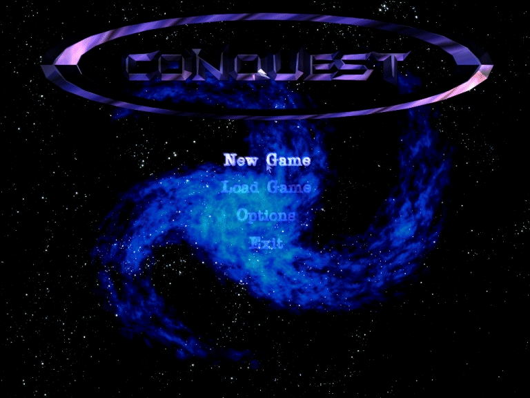



## FerretX8 \(Gaming Engine Using DirectX8\)\(FIXED\!\!\!\)

### Description

To all of those who tried to download this when it first came out: I am soooo sorry the link didn't work most of the time and because of that my submission was removed from PSC. =) So, on to the description which I'll make short and simple. FerretX8 is a gaming engine which I have been working on for several months now and is ready for it's Alpha release...don't be frightened by the term Alpha which means to so many programmers as "the buggy release." Well, this is not the case here, however, there is one part of the engine that does not work YET and that is the 3D rendering part of the engine...I can't seem to get it to work (Venom is currently taking a look into it). The engine incorporates 2D texture and video rendering, audio playback (wav, mp3, etc.), Direct Input, and the loading of resources from a custom File Package which I created. This engine was developed for Arctic Interactive which is my gaming company. This might be the only release to PSC as source code since it does not include a "working" 3D engine...soon to be fixed though. =) We'll see if there will be an update, but for now you guys will probably enjoy this project. I can't upload the file to PSC due to the file size...PSC seems to have a problem with accepting file larger than 2Mb. THE LINK IS LOCATED BELOW THE SCREEN SHOT... Have fun and enjoy!
 
### More Info
 

             |
---                |---
**Submitted On**   |
**By**             |[Chris Dwinell](https://github.com/Planet-Source-Code/PSCIndex/blob/master/ByAuthor/chris-dwinell.md)
**Level**          |Advanced
**User Rating**    |4.6 (41 globes from 9 users)
**Compatibility**  |VB 6\.0
**Category**       |[DirectX](https://github.com/Planet-Source-Code/PSCIndex/blob/master/ByCategory/directx__1-44.md)
**World**          |[Visual Basic](https://github.com/Planet-Source-Code/PSCIndex/blob/master/ByWorld/visual-basic.md)
**Archive File**   |

### Source Code

You can find the source code on my web site in the "Downloads" section: http://www.mtekdesigns.com/

